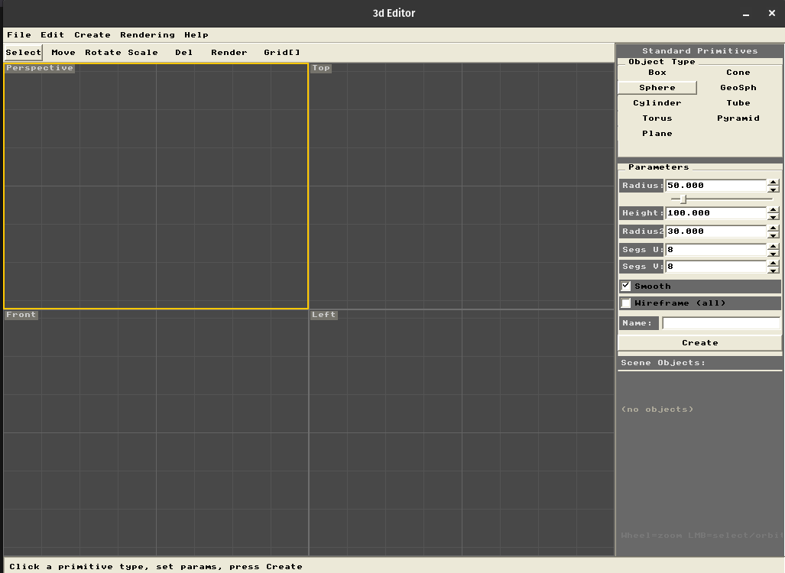
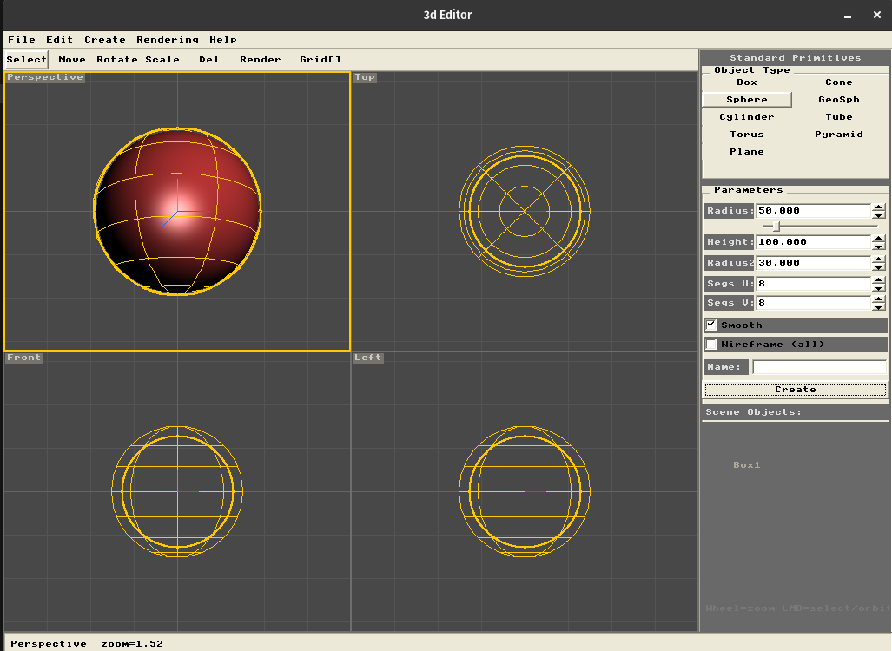
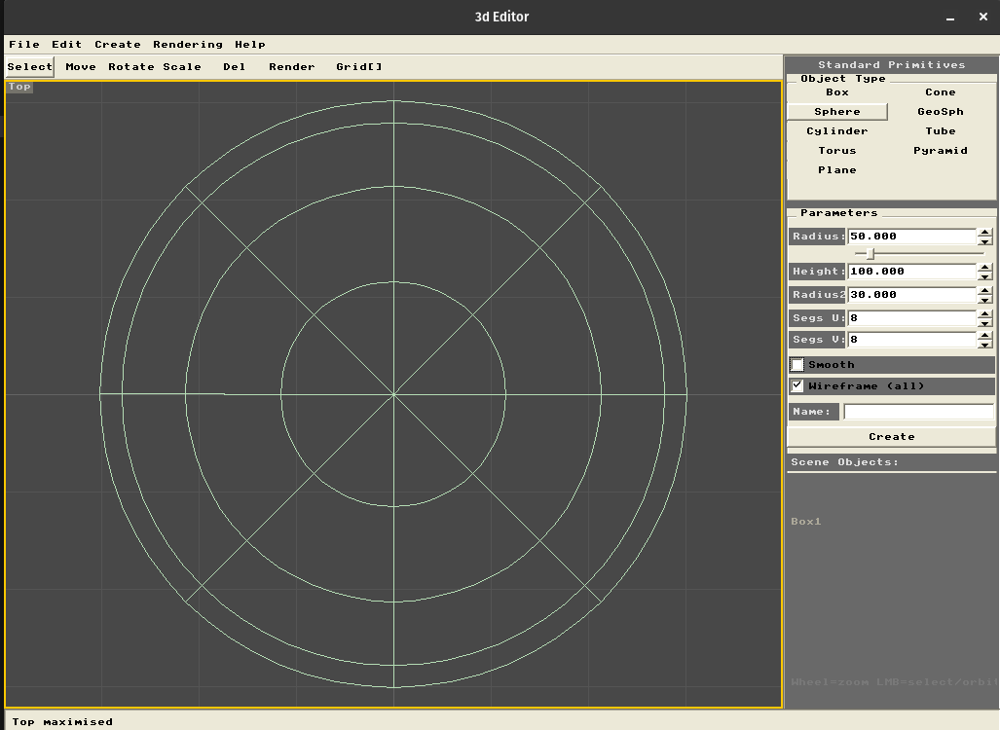

# Cross WinXP UI

<p align="center">
  
  &nbsp;&nbsp;&nbsp;
  
  &nbsp;&nbsp;&nbsp;
  
</p>

> **Nota:** Este proyecto es una **prueba de concepto**. El código fue generado en su mayor parte
> con la asistencia de [Claude](https://claude.ai) (Anthropic) con el enfoqué de tener de forma rápida una librería funcional para pruebas educativas y computación gráfica como hobby.

---

## ¿Qué es esto?

**Cross WinXP UI** es una librería de interfaz gráfica inspirada visualmente en el estilo de
**Windows XP** — bordes bevel, paleta de colores clásica, controles con relieve — construida
completamente sobre **SDL2** con renderizado **por software** (sin OpenGL, sin GPU, sin
dependencias adicionales).

El objetivo es poder crear aplicaciones de escritorio con una estética retro y familiar,
usando **C++11 o C puro**, que compilen y funcionen igual en **Linux y Windows**
sin cambiar una línea de código.

```
┌─────────────────────────────────────────────┐
│  Tu aplicación  (C99 o C++11)               │
├─────────────────────────────────────────────┤
│  wxui_c.h / window_manager.hpp  (API)       │
├─────────────────────────────────────────────┤
│  winxp_ui.hpp  (widgets, render, eventos)   │
├─────────────────────────────────────────────┤
│  SDL2  (ventana, input, superficie)         │
├─────────────────────────────────────────────┤
│  Linux · Windows · macOS                    │
└─────────────────────────────────────────────┘
```

---

## Documentación

| Documento | Contenido |
|---|---|
| [01 — Primeros pasos](docs/01_getting_started.md) | Setup, estructura base, compilación, callbacks del bucle |
| [02 — Widgets](docs/02_widgets.md) | Referencia de todos los widgets, propiedades y eventos |
| [03 — Estado y ciclo de vida](docs/03_state_lifecycle.md) | Gestión de estado, dirty/render, focus, jerarquía |
| [04 — Framebuffer personalizado](docs/04_framebuffer.md) | Render 3D, pixel painting, multi-viewport, widgets custom |
| [05 — Comunicación entre componentes](docs/05_communication.md) | Patrones de eventos, bus, command/undo, selección+panel |

---

## Motivación y objetivos de diseño

### UI familiar, sin dependencias pesadas

Los toolkits de UI modernos (Qt, GTK, wxWidgets) son potentes pero pesados.
La idea aquí fue diferente: ¿qué tan lejos se puede llegar con SDL2 y píxeles?

El resultado es una librería **single-header** que reproduce el look & feel de WinXP
usando solo llamadas a `SDL_FillRect`, líneas de Bresenham y una fuente bitmap 8×8
embebida. Sin imágenes, sin shaders, sin carga de fuentes del sistema.

### Multiplataforma por construcción

SDL2 abstrae la ventana, el input y la superficie de render.
WinXP UI nunca llama a APIs de sistema operativo directamente, lo que significa
que el mismo código fuente produce el mismo resultado visual en cualquier plataforma
donde SDL2 esté disponible.

### Usable desde C puro

Muchos proyectos embebidos, motores de juego legacy o toolchains de investigación
trabajan en C. El wrapper `wxui_c.h / wxui_c.cpp` expone toda la funcionalidad
a través de punteros opacos y funciones `extern "C"`, sin exponer una sola línea
de C++ al código del usuario.

### Render de framebuffer propio

El widget `UIViewport3D` acepta un buffer de píxeles `uint32_t[]` (formato ARGB)
generado por el usuario — un rasterizador 3D, un emulador, un editor de sprites,
lo que sea — y lo compone dentro de la UI como un ciudadano de primera clase.
Esto hace posible construir herramientas estilo editores 3D clásicos, editores de nivel o
cualquier aplicación que mezcle controles estándar con un área de render personalizada.

---

## Características

- **Widgets completos:** Panel, Label, Button, Checkbox, RadioButton, Slider, Spinner,
  TextInput, ScrollBar, GroupBox, Separator, MenuBar, Toolbar, TabPanel, Window flotante,
  Viewport 3D
- **Sistema de eventos** basado en callbacks por widget y por tipo de evento
- **Render retenido:** los widgets solo se redibujan cuando su estado cambia (dirty flag)
- **Jerarquía de componentes** con soporte de capas (z-order)
- **Fuente bitmap 8×8** embebida — sin dependencias de fuentes del sistema
- **Paleta WinXP** fiel: grises cálidos, azul titlebar, controles en relieve
- **API C completa** con tipos opacos para proyectos sin C++
- **Single-header C++11:** `winxp_ui.hpp` no requiere compilación separada

---

## Requisitos

| Componente | Versión mínima |
|---|---|
| SDL2 | 2.0.x |
| Compilador C++ | C++11 (`g++`, `clang++`, MSVC 2017+) |
| Compilador C (opcional) | C99 |

```bash
# Debian / Ubuntu
sudo apt install libsdl2-dev

# macOS
brew install sdl2

# Windows (vcpkg)
vcpkg install sdl2
```

---

## Estructura del proyecto

```
WinXPUI/
├── compile.sh              # Script de compilación (Linux/macOS)
├── include/
│   ├── winxp_ui.hpp        # Librería principal — single-header C++11
│   ├── window_manager.hpp  # Wrapper de Application: oculta SDL2 al usuario
│   └── wxui_c.h            # API pública para C puro (tipos opacos)
├── src/
│   └── wxui_c.cpp          # Implementación del wrapper C
└── examples/
    ├── demo_state.cpp       # Gestión de estado en C++
    ├── demo_state.c         # Gestión de estado en C puro
    └── 3d_editor.cpp        # Render de framebuffer + viewport 3D
```

---

## Compilación rápida

```bash
# C++ — un solo paso
g++ -std=c++11 mi_app.cpp -o mi_app -I./include $(sdl2-config --cflags --libs)

# C puro — usando compile.sh
./compile.sh examples/demo_state.c     # → ejecutable demo_state
./compile.sh examples/3D/main.cpp      # también funciona con .cpp
```

El script compila `wxui_c.cpp` como objeto intermedio y lo enlaza con tu archivo.
El paso final siempre usa `g++` porque `wxui_c.o` contiene runtime C++, aunque
el código del usuario sea C puro.

**Compilación manual:**
```bash
g++ -std=c++11 -c src/wxui_c.cpp -o wxui_c.o -I./include $(sdl2-config --cflags)
gcc -std=c99   -c mi_app.c        -o mi_app.o -I./include $(sdl2-config --cflags)
g++               wxui_c.o mi_app.o -o mi_app             $(sdl2-config --libs)
```

---

## Ejemplo mínimo en C++

```cpp
#include "winxp_ui.hpp"
#include "window_manager.hpp"
using namespace WXUI;

int main() {
    Application app("Hola", 400, 300);
    if (!app.ok()) return 1;

    int clicks = 0;
    auto* lbl = static_cast<UILabel*>(
        app.add(Make::Label("lbl", Rect(150, 100, 100, 20), "Clicks: 0"))
    );
    auto* btn = static_cast<UIButton*>(
        app.add(Make::Button("btn", Rect(150, 130, 100, 30), "Click!"))
    );
    btn->on(EventType::Click, [&](UIComponent*, const UIEvent&) {
        lbl->setText("Clicks: " + std::to_string(++clicks));
    });

    app.run(60);
}
```

## Ejemplo mínimo en C

```c
#include "wxui_c.h"
#include <stdio.h>

typedef struct { WXWidget* lbl; int clicks; } State;

static void on_click(WXWidget* w, const WXEvent* e, void* ud) {
    State* s = (State*)ud;
    char buf[32];
    snprintf(buf, sizeof(buf), "Clicks: %d", ++s->clicks);
    wxwidget_set_text(s->lbl, buf);
    (void)w; (void)e;
}

int main(void) {
    WXApp* app = wxapp_create("Hola", 400, 300, 1, 1);
    State s = { wxmake_label(app, "lbl", 150, 100, 100, 20, "Clicks: 0", 0), 0 };
    WXWidget* btn = wxmake_button(app, "btn", 150, 130, 100, 30, "Click!");
    wxwidget_on(btn, WXEV_CLICK, on_click, &s);
    wxapp_run(app, 60);
    wxapp_destroy(app);
    return 0;
}
```

---

## Sistema de coordenadas

El origen `(0, 0)` está en la esquina **superior izquierda** de la ventana.
Todos los widgets se posicionan con coordenadas absolutas `Rect(x, y, ancho, alto)`.

```
(0,0) ──────────────────────► X
  │
  │    Rect(50, 30, 120, 40)
  │    ┌─────────────────┐  ← y = 30
  │    │                 │
  │    └─────────────────┘  ← y = 70
  │    ↑ x=50         ↑ x=170
  ▼
  Y
```

El render es **por software**: cada widget tiene su propio `SDL_Surface` que se
compone en la superficie raíz una vez por frame, la cual se sube a la GPU como
textura para la presentación final.

---

## Limitaciones conocidas

- **Sin aceleración GPU:** el render es 100% por CPU. Adecuado para UIs de herramientas,
  no para juegos con miles de sprites.
- **Fuente única:** la fuente bitmap 8×8 no soporta caracteres fuera de ASCII 32–126.
- **Sin internacionalización:** no hay soporte de Unicode, RTL ni IME.
- **Coordenadas absolutas:** no hay sistema de layout automático (flexbox, grid, etc.).
  Los widgets se posicionan manualmente y se reposicionan en `onResize`.
- **Prueba de concepto:** la API puede cambiar; no hay garantía de estabilidad.

---

## Licencia

Código generado como experimento. Úsalo, modifícalo y distribúyelo libremente.